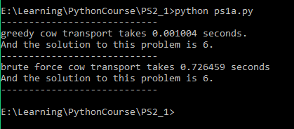
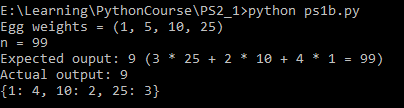

# 实验报告
## 一、 Problem A.5: Writeup
1. What were your results from compare_cow_transport_algorithms? Which
algorithm runs faster? Why?

    实验结果如图：

    

    贪心算法运行更快。假设有n头牛，贪心算法的时间复杂度为<b>O(N<sup>2</sup>)</b>，属于多项式复杂度，而暴力算法的时间复杂度为<b>O(2<sup>N</sup>)</b>，属于指数级复杂度。
2. Does the greedy algorithm return the optimal solution? Why/why not?
    
    在这个样例中，贪心算法返回了正确的结果。但是并非总是如此，在某些样例下，贪心算法不能得到正确的结果。

3. Does the brute force algorithm return the optimal solution? Why/why not?

    暴力算法是可以总是返回正确的结果的。因为暴力算法列举了所有可能的情况，再从中选取最优的。
## 二、 Problem B.2: Writeup
1. Explain why it would be difficult to use a brute force algorithm to solve this problem if there were 30 different egg weights. You do not need to implement a brute force algorithm in order to answer this

    假设飞船可以承载的最大重量为N，则暴力算法的时间复杂度为<b>O(30<sup>N</sup>)</b>，远远超出当前计算机的计算能力，是很难算出来的。
2. If you were to implement a greedy algorithm for finding the minimum number of eggs
needed, what would the objective function be? What would the constraints be? What strategy
would your greedy algorithm follow to pick which coins to take? You do not need to implement a
greedy algorithm in order to answer this.

    贪心策略是：在总重量不超出限制的情况下，总是优先选取重量最大的蛋。限制就是总重量不能超出限制。
3. Will a greedy algorithm always return the optimal solution to this problem? Explain why it is optimal or give an example of when it will not return the optimal solution. Again, you do not need to implement a greedy algorithm in order to answer this.

    贪心策略不能总是得到正确的结果。
    举例：
    ```python
    egg_weights=(1,5,6)
    target_weight=10
    ```
    在这样的情况下，依据贪心策略，会选取6 * 1+1 * 4作为结果，需要5个蛋，而最优解为5*2，只需要2个蛋。
## 三、 代码实现
1. 读取牛的名字以及体重信息
    ```python
    def load_cows(filename):
        ans={}#返回值
        file=open(filename,"r")#打开文件
        while True:#无穷循环
            s=file.readline()#读取一行
            if len(s)<=0:#遇到空行就跳出循环
                break
            words=s.split(',')#使用逗号对一行进行分割
            ans[words[0]]=int(words[1])#建立映射关系
        file.close()#关闭文件
        return ans#返回ans
    ```
2. 贪心算法
    ```python
    def greedy_cow_transport(cows,limit=10):
        ans=[]#返回值
        for v in cows.values():#检查牛的重量
            if v>limit:#如果存在牛的重量大于飞船重量上限
                #则无法将这批牛运回
                return ["Can't do this!"]
        cows_copy=cows.copy()#创建cows的副本
        while len(cows_copy)>0:#当副本中还有元素
            sum=0#当前飞船携带的牛的重量
            ship=[]#当前飞船携带的牛的名字列表

            #副本非空并且重量没有超限
            while sum<limit and len(cows_copy)>0:
                Max=list(iter(cows_copy))[0]#记录当前满足条件的牛的名字
                for k in cows_copy.keys():#遍历牛群
                    #如果带上这头牛不会超出重量限制并且这头牛比Max更重
                    if cows_copy[k]>cows_copy[Max] and sum+cows_copy[k]<=limit:
                        Max=k#更新Max
                if sum+cows_copy[Max]<=limit:#如果重量没有超限
                    ship.append(Max)#将Max加到飞船上
                    sum+=cows_copy[Max]#加上Max的重量
                    cows_copy.pop(Max)#从副本中移除Max
                else:#如果超限，表示这一趟飞船不能装下更多牛了
                    break
            ans.append(ship)#将ship加入到ans中
        return ans#返回ans
    ```
3. 暴力算法
    ```python
    def brute_force_cow_transport(cows,limit=10):
        partitions=get_partitions(cows.keys())#获取所有划分
        for partition in partitions:#对每一个划分计算是否超出重量限制
            ok=1#标志该划分是否合法
            #划分中的每一个列表L表示一趟飞船中载有的牛的名字
            for L in partition:
                sum=0#飞船上牛的总重
                for element in L:
                    sum+=cows[element]#加上这头牛的重量
                if sum>limit:#如果超限
                    ok=0#置ok为0
                    break
            if ok:#如果该划分合法
                return partition#返回该划分
    ```
4. 比较上述两种解法
    ```python
    def compare_cow_transport_algorithms():
    cows=load_cows("ps1_cow_data.txt")#读取牛群信息
    t=time.time()#开始计时
    ans1=greedy_cow_transport(cows)#运行贪心算法函数
    t=time.time()-t#计算时间差
    print('----------------------------')
    print("greedy cow transport takes %lf seconds."%t)#格式化输出
    print("And the solution to this problem is %d."%len(ans1))

    print('----------------------------')
    t=time.time()#开始计时
    ans2=brute_force_cow_transport(cows)#运行暴力算法
    t=time.time()-t#计算时间差
    print("brute force cow transport takes %lf seconds"%t)#格式化输出
    print("And the solution to this problem is %d."%len(ans2))
    print('----------------------------')
    ```
5. 动态规划求最少的蛋的数目

    用dp[i]表示蛋的总重量为i时所需的最少的蛋的数目。状态转移方程为
    ```python
    dp[i]=min(dp[i-egg_weights[i]])+1
    ```
    时间复杂度为<b>O(MN)</b>，其中M为鹅的数目，N表示目标重量。

    程序为：
    ```python
    def dp_make_weight(egg_weights, target_weight, memo = {}):
        dp=[target_weight]*(target_weight+1)#长度为target_weight+1的数组
        dp[0]=0#初始化
        dp[1]=1
        for i in range(target_weight+1):#从0到target_weight计算dp[i]
            for egg_weight in egg_weights:#遍历egg_weights
                if i-egg_weight>=0:#下标应该大于等于0
                    dp[i]=min(dp[i],dp[i-egg_weight]+1)#状态转移方程
        
        #计算每种蛋的数目
        #找到egg_weight使dp[temp-egg_weight]+1==dp[temp]
        #然后temp减去egg_weight，进行下一轮循环
        temp=target_weight
        while temp>0:
            for egg_weight in egg_weights:
                if temp-egg_weight>=0 and dp[temp-egg_weight]+1==dp[temp]:
                    memo[egg_weight]=memo.get(egg_weight,0)+1
                    temp-=egg_weight
                    break
        return dp[target_weight]#返回最少的蛋的数目
    ```
## 四、 运行结果
1. psa

    两种算法都返回了正确的结果

    
2. psb

    返回的结果与预期相符

     
## 五、 实验心得
* 动态规划的核心思想是把问题分解为更小的子问题，求解子问题后将结果存储起来，并由子问题的结果求解后面的问题。在处理动态规划问题时，最重要的是找到状态以及状态转移方程。状态指的是每个阶段开始面临的条件；状态转移方程是描述从一个状态转移到另一个状态的方程。
* 贪心算法虽然有时候不能得到正确的结果，但是仍然具有很大的价值。一般来说，贪心算法的编程较为简单，运行起来也较快，有些时候也可以得到一些近似的或者正确的结果。