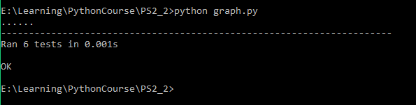
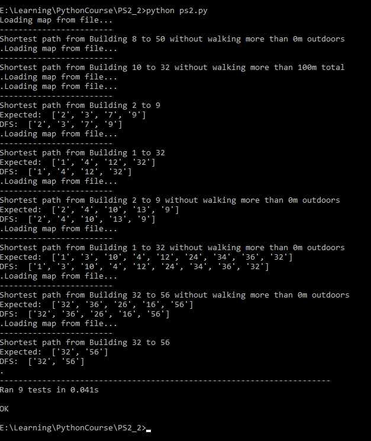
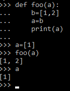
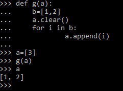

# 实验报告
## 一、 实验目的
编写程序找到MIT校园内两栋建筑物之间的最快路径
## 二、 实验思路
1. 建立合适的数据结构表示图以及图的边集、顶点集。
2. 从文件中读取数据以建立校园地图，其中：
    * 顶点表示校园内的建筑物
    * 边表示两个顶点之间的路径
    * 边的权重表示两个建筑物之间的距离
3. 使用深度优先算法（DFS）找到在一定限制条件下，两个顶点之间的最快路径。
## 三、 主要函数
1. Digraph类
    ```python
    class Digraph(object):
        """Represents a directed graph of Node and Edge objects"""
        def __init__(self):
            self.nodes = set([])
            self.edges = {}  # must be a dict of Node -> list of edges

        def add_node(self, node):#将一个顶点加入到图的顶点集中
            """Adds a Node object to the Digraph. Raises a ValueError if it is
            already in the graph."""
            previous_number=len(self.nodes)#图中已有的顶点数
            self.nodes.add(node)#将node加入到顶点集中
            if len(self.nodes)==previous_number:
                #如果图的顶点数没有变化，表明图中已有该顶点，抛出错误
                raise ValueError("It is already in the graph")


        def add_edge(self, edge):#将一条边加入到图的边集中
            """Adds an Edge or WeightedEdge instance to the Digraph. Raises a
            ValueError if either of the nodes associated with the edge is not
            in the  graph."""
            #如果边的某个端点不在图的顶点集中，抛出异常
            if (not edge.src in self.nodes) or (not edge.dest in self.nodes):
                raise ValueError
                    ("The nodes associated with the edge is not in the graph.")
            #获取边的源点的出边集
            l=self.edges.get(edge.get_source(),[])
            l.append(edge)#将该边加入到上述集合
            self.edges[edge.get_source()]=l#修改源点的出边集
        
        #Ignore oher functions here
    ```
2. 加载地图函数
    ```python
    def load_map(map_filename):
        print("Loading map from file...")
        G=Digraph()#创建一个空图
        file=open(map_filename,"r")#以只读方式打开
        while True:
            s=file.readline()#读取一行
            if len(s)==0:#读到空行为止
                break
            nums=s.split(' ')#根据空格将一行内容分割
            src=Node(nums[0])#源点
            dest=Node(nums[1])#终点
            if not G.has_node(src):#图中没有源点时，加入到顶点集中
                G.add_node(src)
            if not G.has_node(dest):#图中没有终点时，加入到顶点集中
                G.add_node(dest)
            #c创建一条边
            edge=WeightedEdge(src,dest,int(nums[2]),int(nums[3]))
            #将边加入到图的边集中
            G.add_edge(edge)
        file.close()#关闭文件
        return G#返回图
    ```
3. 找到最优路径
    ```python
    Best_dist=99999#两个建筑物之间最小的总距离
    def get_best_path(digraph, start, end, path, max_dist_outdoors, best_dist,
                    best_path):
        #digraph：Digraph，图
        #start：Node，路径的源点
        #end: Node，路径的终点
        #path：list，第一个元素是当前已经访问过的顶点的名字的列表
        #            第二、三个元素分别是已访问过的路径上的距离以及户外距离之和
        #max_dist_outdoors：int，允许的最大户外距离
        #best_path：list，当前最短路径上的顶点的名字的列表

        #best_dist：int，允许的最大总距离

        global Best_dist#声明Best_dist是全局变量
        if not digraph.has_node(start):#顶点不在图的顶点集中
            raise ValueError("Bad test case!")#抛出错误
        elif start==end:#到达目的顶点
            #判断当前路径是否更优
            if path[1]<=Best_dist and path[2]<=max_dist_outdoors:
                Best_dist=path[1]#更新最短总距离
                
                #将path[0]的内容赋给best_path
                best_path.clear()
                length=len(path[0])
                for i in list(range(length)):
                    best_path.append(path[0][i])
                return tuple(best_path)#返回best_path的元组
        #如果当前路径的距离已大于已知最优路径或者超出最大户外距离，直接返回，不再继续
        elif path[1]>Best_dist or path[2]>max_dist_outdoors:
            return None
        else:
            edges=digraph.get_edges_for_node(start)#顶点的出边集
            for edge in edges:#遍历每一条边
                dest=edge.get_destination()#边的终点
                #如果终点不在当前路径中并且加上边的距离后仍没有超出总距离的限制
                if not dest.get_name() in path[0] and 
                        path[1]+edge.get_total_distance()<=best_dist:

                    #将终点加入到当前路径中
                    path[0].append(dest.get_name())
                    #path[1]加上边的距离
                    path[1]+=edge.get_total_distance()
                    #path[2]加上边的户外距离
                    path[2]+=edge.get_outdoor_distance()
                    #递归解决子问题
                    get_best_path(digraph,dest,end,path,
                        max_dist_outdoors,best_dist,best_path)
                    
                    #恢复递归前状态
                    path[1]-=edge.get_total_distance()
                    path[2]-=edge.get_outdoor_distance()
                    path[0].pop()
        #如果没找到到终点的合适路径，返回None
        if best_path==None or len(best_path)==0:
            return None
        #返回最优路径的元组
        return tuple(best_path)
    ```
4. 有向图的深度优先算法（DFS）
    ```python
    def directed_dfs(digraph, start, end, max_total_dist, max_dist_outdoors):
        #digraph：Digraph，图
        #start：str，源点的名字
        #end：str，终点的名字
        #max_total_dist：int，最大总距离
        #max_dist_outdoors：int，最大户外距离
        global Best_dist#声明全局变量
        Best_dist=99999#每次开始DFS前初始化
        start=Node(start)#创建顶点
        end=Node(end)#创建顶点
        #如果源点或终点不在图中
        if (not digraph.has_node(start)) or (not digraph.has_node(end)):
            #抛出错误
            raise ValueError("Bad test case!")
        path=[[start.get_name()],0,0]#初始化path
        best_path=[]#初始化best_path
        #调用函数
        ans=get_best_path(digraph,start,end,path,
            max_dist_outdoors,max_total_dist,best_path)
        if best_path==None or len(best_path)==0:#如果没有合适的路径
            raise ValueError("Bad test case!")#抛出异常
        return list(ans)#返回结果
    ```
## 四、 实验结果
1. 测试graph .py

    

2. 测试ps2. py

    

## 五、 实验心得
1. 在graph类的add_edge函数中，添加一条边使用的是以下语句：

    ```python       
    l=self.edges.get(edge.get_source(),[])
    l.append(edge)
    self.edges[edge.get_source()]=l
    ```

    而不是
    ```python
    self.edges[edge.get_source()].append(edge)
    ```
    是因为当前图的顶点集中可能没有边的源点，直接添加会引起KeyError。
2. 刚开始测试get_best_path时，发现在递归时，明明在被调用的函数中best_path已经被修改为当前最佳路径，但是在返回上一层函数时，best_path又变回了空列表。在进行其他测试后发现，函数中传递的是列表的引用，也就是说可以在函数里面更改列表中的内容，但是在函数中给列表赋值（将另一个列表赋给该列表）却不能改变该列表原有的值。

    

    如图所示，定义了一个函数，在函数中试图将一个列表b赋给列表a。在调用该函数后，可以看到a的值并没有改变。
    
    因此，需要在函数中先清空列表a的内容，再将列表b中的数据一一添加到a中。
    
    