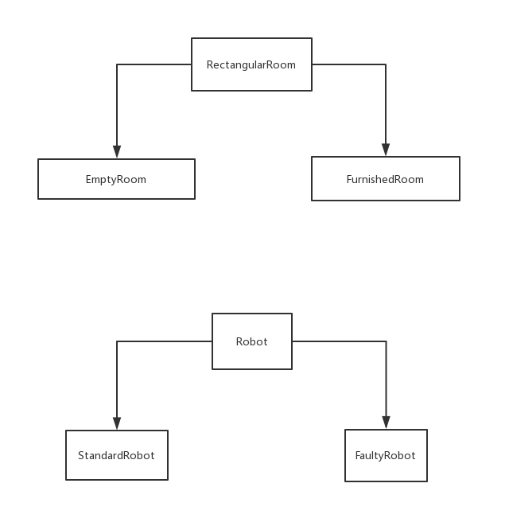
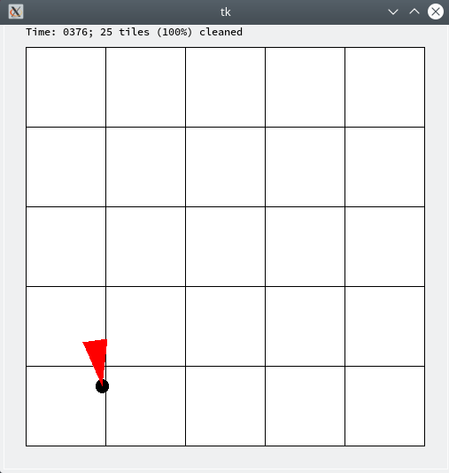
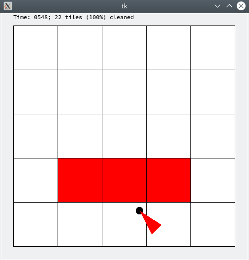
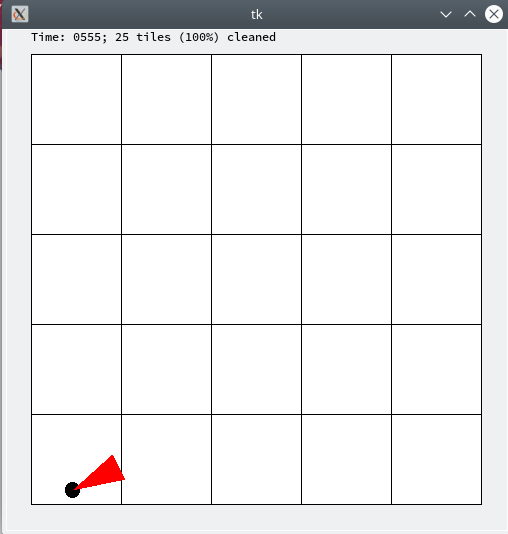
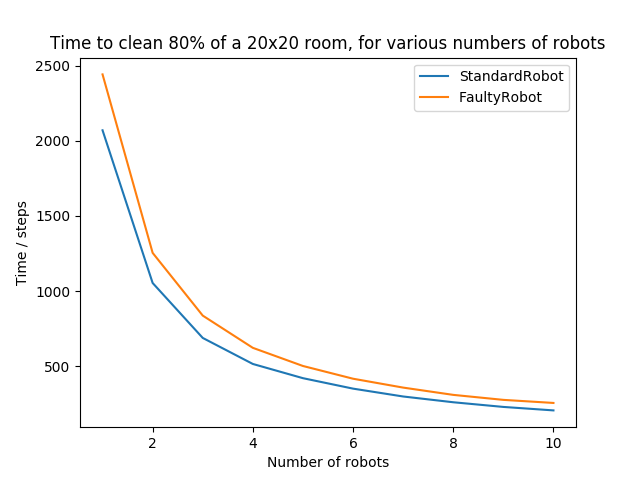
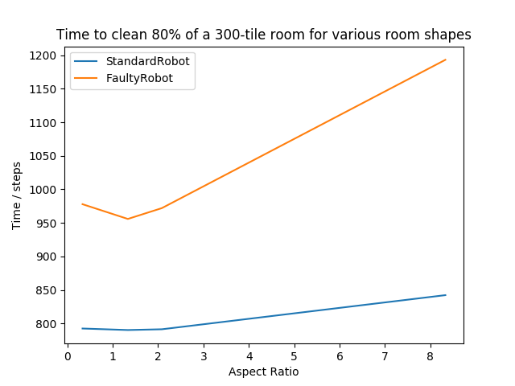

# 实验报告
## 一、 实验目的
编写程序模拟房间内扫地机器人的移动。
## 二、 实验思路
* 首先，确定一个Position类，表示机器人在房间中的位置。
* 对于房间，首先编写一个抽象基类表示房间的一些共性。然后再根据房间的类型，在继承抽象基类的基础上，派生出不同类型的房间。
* 对于机器人，与房间类似，首先编写一个抽象基类表示机器人的共性，然后再根据机器人的清扫策略，派生出标准的机器人（StandardRobot）和出错的机器人（FaultyRobot）。
* 根据机器人类和房间类，模拟机器人清扫房间的行为。
## 三、 关键代码

1. 房间抽象基类
    ```python
    class RectangularRoom(object):
        def __init__(self, width, height, dirt_amount):
            self.width=math.ceil(width)#房间宽度
            self.height=math.ceil(height)#房间高度
            self.dirt_amount=dirt_amount#房间每个区块初始灰尘数量
            self.clean_tiles=0#干净的区块数量
            self.dirty_tiles=width*height#脏的区块数量
            
            self.tile_dirt=[]#初始化每个区块的灰尘数目
            for x in range(self.width):
                temp=[]
                for y in range(self.height):
                    temp.append(dirt_amount)#初始值为dirt_amount
                self.tile_dirt.append(temp[:])
        
        def clean_tile_at_position(self, pos, capacity):
            #获得区块的坐标
            x=math.floor(pos.get_x())
            y=math.floor(pos.get_y())
            before=False#区块在清理前是否干净，默认为否
            if self.tile_dirt[x][y]<0.000001:#如果区块灰尘数量为0，则干净
                before=True
            self.tile_dirt[x][y]=max(self.tile_dirt[x][y]-capacity,0)#清理该区块
            
            after=False##区块在清理后是否干净，默认为否
            if self.tile_dirt[x][y]<0.000001:#如果区块灰尘数量为0，则干净
                after=True
            
            if before and not after:#如果打扫前干净、打扫后不干净
                self.clean_tiles-=1#干净区块数减1
                self.dirty_tiles+=1#脏的区块数加1
            elif not before and after:#如果打扫前不干净，打扫后干净
                self.clean_tiles+=1#干净区块数加1
                self.dirty_tiles-=1#脏的区块数减1
            #其他情况干净和脏的区块数都不变


        def is_tile_cleaned(self, m, n):#判断区块是否干净
            return self.tile_dirt[m][n]<0.000001

        def get_num_cleaned_tiles(self):#获取干净区块的数量
            return self.clean_tiles
            
        def is_position_in_room(self, pos):#判断位置是否在房间中
            #获取区块的坐标
            x=pos.get_x()
            y=pos.get_y()
            if x<0 or x>=self.width:
                return False
            if y<0 or y>=self.height:
                return False
            return True
            
        def get_dirt_amount(self, m, n):#获取脏的区块数量
            return self.tile_dirt[m][n]
    ```
2. 机器人抽象基类
    ```python
    class Robot(object):
        def __init__(self, room, speed, capacity):
            self.room=room#机器人所在房间
            self.speed=speed#机器人的速度
            self.capacity=capacity#机器人的清扫能力
            self.position=room.get_random_position()#机器人的初始位置
            self.direction=random.random()*360#机器人的初始方向


        def get_robot_position(self):#获取机器人的位置
            return self.position

        def get_robot_direction(self):#获取机器人的方向
            return self.direction

        def set_robot_position(self, position):#设置机器人的位置
            self.position=position

        def set_robot_direction(self, direction):#设置机器人的方向
            self.direction=direction
    ```
3. RectangularRoom的派生类EmptyRoom
    ```python
    class EmptyRoom(RectangularRoom):
        def get_num_tiles(self):#返回房间中区块数量
            return self.width*self.height
            
        def is_position_valid(self, pos):#判断一个位置是否合法
            return RectangularRoom.is_position_in_room(self,pos)
            
        def get_random_position(self):#获取房间中的一个随机位置
            x=random.random()*self.width
            y=random.random()*self.height
            return Position(x,y)
    ```
4. RectangularRoom的派生类FurnishedRoom
    ```python
    class FurnishedRoom(RectangularRoom):
        def __init__(self, width, height, dirt_amount):
            #初始化父类
            RectangularRoom.__init__(self, width, height, dirt_amount)
            self.furniture_tiles = []#家具所在的区块
            
        def add_furniture_to_room(self):
            pass         

        def is_tile_furnished(self, m, n):#判断某个区块是否有家具
            return (m,n) in self.furniture_tiles
            
        def is_position_furnished(self, pos):#判断某个位置是否有家具
            #获取区块的坐标
            m=math.floor(pos.get_x())
            n=math.floor(pos.get_y())
            return (m,n) in self.furniture_tiles
            
        def is_position_valid(self, pos):#判断某个位置是否合法
            #是否在房间内以及位置上是否有家具
            return RectangularRoom.is_position_in_room(self,pos) and not 
                self.is_position_furnished(pos)
            
        def get_num_tiles(self):#获取房间内有效区块的数量
            return self.width*self.height-len(self.furniture_tiles)
            
        def get_random_position(self):#获取房间内的一个随机位置
            temp=[]#当前区块是否为有效区块
            for x in range(self.width):
                t=[]
                for y in range(self.height):
                    t.append(True)#初始值为有效区块
                temp.append(t)
            
            #遍历self.furniture_tiles，其中的区块设置为无效区块
            for t in self.furniture_tiles:
                temp[t[0]][t[1]]=False
            
            no_furniture_tile=[]#有效区块
            #将temp中为True的区块加入no_furniture_tile中
            for i in range(self.width):
                for j in range(self.height):
                    if temp[i][j]:
                        no_furniture_tile.append((i,j))

            #偏移值
            delta_x=random.random()
            delta_y=random.random()
            #随机选择一个区块
            (m,n)=random.choice(no_furniture_tile)
            return Position(m+delta_x,n+delta_y)#返回一个有效的随机位置
    ```
5. Robot的派生类StandardRobot
    ```python
    class StandardRobot(Robot):

        def update_position_and_clean(self):#重写update_position_and_clean方法
            #计算机器人的下一个位置
            next_pos=self.position.get_new_position(self.direction,self.speed)
            #如果位置合法
            if self.room.is_position_valid(next_pos):
                self.position=next_pos#移动到新位置
                #打扫新位置
                self.room.clean_tile_at_position(self.position,self.capacity)
            else:
                #否则随机选择一个方向
                self.direction=random.random()*360
    ```
6. Robot的派生类FaultyRobot
    ```python
    class FaultyRobot(Robot):
        p = 0.15#出错的概率

        @staticmethod
        def set_faulty_probability(prob):#设置出错概率
            FaultyRobot.p = prob
        
        def gets_faulty(self):#决定这次机器人是否出错
            return random.random() < FaultyRobot.p
        
        def update_position_and_clean(self):#重写update_position_and_clean方法
            faulty=self.gets_faulty()#这次机器人是否出错
            if faulty:#如果出错
                self.direction=random.random()*360#随机选择一个新方向
            else:#否则行为与StandardRobot一致
                next_pos=self.position.get_new_position
                    (self.direction,self.speed)
                if self.room.is_position_valid(next_pos):
                    self.position=next_pos
                    self.room.clean_tile_at_position
                        (self.position,self.capacity)
                else:
                    self.direction=random.random()*360
    ```
7. 模拟机器人的运行情况
    ```python
    def run_simulation(num_robots, speed, capacity, width, height, dirt_amount, 
            min_coverage, num_trials, robot_type):

        # num_robots: 房间内机器人数量
        # speed: 机器人的速度
        # capacity: 机器人的清扫能力
        # width: 房间宽度
        # height: 房间高度
        # dirt_amount: 每个区块的初始灰尘数量
        # min_coverage: 最低的清扫目标
        # num_trials: 模拟次数
        # robot_type: 机器人的类型

        tile_num=width*height#房间的区块数
        time_step=[]#每次测试所需的时间
        for i in range(num_trials):#测试num_trials次
            # anim=ps3_visualize.RobotVisualization
            #    (num_robots, width, height,False)
            robots=[]#机器人
            #房间
            room=EmptyRoom(width,height,dirt_amount)

            for i in range(num_robots):#创建num_robots个机器人
                robots.append(robot_type(room,speed,capacity))

            count=0#计算时间
            #当干净的区块数没有达到要求时
            while room.get_num_cleaned_tiles()<tile_num*min_coverage:
                for robot in robots:#每个机器人单独行动
                    robot.update_position_and_clean()
                count+=1
                # anim.update(room,robots)
            time_step.append(count)
            # anim.done()
        sum=0
        for time in time_step:
            sum+=time
        return sum/num_trials#返回平均值
    ```
## 四、 运行结果
1. ps3_tests_f16.py测试结果
    ```
    ps3_tests_f16.py:9: DeprecationWarning: the imp module is deprecated in favour of importlib; see the module's documentation for alternative uses
    import imp
    test_clean_tile_at_position_PosToPos (__main__.ps3_P1A)
    Test if clean_tile_at_position removes all dirt ... ok
    test_clean_tile_at_position_PosToZero (__main__.ps3_P1A)
    Test if clean_tile_at_position removes all dirt ... ok
    test_clean_tile_at_position_ZeroToZero (__main__.ps3_P1A)
    Test if clean_tile_at_position removes all dirt ... ok
    test_get_num_cleaned_tiles_FullIn1 (__main__.ps3_P1A)
    Test get_num_cleaned_tiles for cleaning subset of room completely with 1 call ... ok
    test_get_num_cleaned_tiles_FullIn2 (__main__.ps3_P1A)
    Test get_num_cleaned_tiles for cleaning subset of room in two calls ... ok
    test_get_num_cleaned_tiles_OverClean (__main__.ps3_P1A)
    Test cleaning already clean tiles does not increment counter ... ok
    test_get_num_cleaned_tiles_Partial (__main__.ps3_P1A)
    Test get_num_cleaned_tiles for cleaning subset of room incompletely ... ok
    test_is_position_in_room (__main__.ps3_P1A)
    Test is_position_in_room ... ps3_tests_f16.py:181: DeprecationWarning: Please use assertEqual instead.
    "position {},{} is incorrect: expected {}, got {}".format(x, y, solution_room.is_position_in_room(pos), room.is_position_in_room(pos))
    ok
    test_is_tile_cleaned_clean (__main__.ps3_P1A)
    Test is_tile_cleaned ... ok
    test_is_tile_cleaned_dirty (__main__.ps3_P1A)
    Test is_tile_cleaned ... ok
    test_room_dirt_clean (__main__.ps3_P1A) ... ps3_tests_f16.py:53: DeprecationWarning: Please use assertEqual instead.
    "Tile {} was not initialized with correct dirt amount".format((x, y))
    ok
    test_room_dirt_dirty (__main__.ps3_P1A) ... ps3_tests_f16.py:41: DeprecationWarning: Please use assertEqual instead.
    "Tile {} was not initialized with correct dirt amount".format((x, y))
    ok
    test_unimplemented_methods (__main__.ps3_P1A)
    Test if student implemented methods in RectangularRoom abstract class that should not be implemented ... ok
    test_getset_robot_direction (__main__.ps3_P1B)
    Test get_robot_direction and set_robot_direction ... ps3_tests_f16.py:205: DeprecationWarning: Please use assertEqual instead.
    "Robot direction set or retrieved incorrectly: expected {}, got {}".format(directions[dir_index], robot_dir)
    ok
    test_unimplemented_methods (__main__.ps3_P1B)
    Test if student implemented methods in Robot abstract class that should not be implemented ... ok
    test_get_num_tiles (__main__.ps3_P2_ER)
    test get_num_tiles method ... ps3_tests_f16.py:247: DeprecationWarning: Please use assertEqual instead.
    "student code number of room tiles = {}, not equal to solution code num tiles {}".format(room_num_tiles, sol_room_tiles)
    ok
    test_get_random_position (__main__.ps3_P2_ER)
    Test get_random_position ... ok
    test_is_position_valid (__main__.ps3_P2_ER)
    Test is_position_valid ... ps3_tests_f16.py:262: DeprecationWarning: Please use assertEqual instead.
    "student code and solution code disagree on whether position is valid"
    ok
    test_get_num_tiles (__main__.ps3_P2_FR)
    test get_num_tiles method ... ps3_tests_f16.py:331: DeprecationWarning: Please use assertEqual instead.
    "student code number of room tiles = {}, not equal to solution code num tiles {}".format(room_num_tiles, sol_room_num_tiles)
    ok
    test_get_random_position (__main__.ps3_P2_FR)
    Test get_random_position for FurnishedRoom ... ok
    test_is_position_furnished (__main__.ps3_P2_FR)
    test_is_position_furnished ... ps3_tests_f16.py:295: DeprecationWarning: Please use assertEqual instead.
    "student code and solution code disagree on whether position is furnished"
    ok
    test_is_position_valid (__main__.ps3_P2_FR)
    Test is_position_valid ... ps3_tests_f16.py:312: DeprecationWarning: Please use assertEqual instead.
    "student code and solution code disagree on whether position is valid"
    ok
    test_is_tile_furnished (__main__.ps3_P2_FR)
    test is_tile_furnished ... ps3_tests_f16.py:279: DeprecationWarning: Please use assertEqual instead.
    "student code and solution code disagree on whether tile is furnished"
    ok
    testRobot (__main__.ps3_P3)
    Test StandardRobot ... ok
    test_BoundaryConditions (__main__.ps3_P3)
    Test strict inequalities in random positions for the EmptyRoom and StandardRobot ... ok
    test_update_position_and_cleanStandardRobot (__main__.ps3_P3)
    Test StandardRobot.update_position_and_clean ... ps3_tests_f16.py:425: DeprecationWarning: Please use assertEqual instead.
    (90, robot.get_robot_direction()))
    ps3_tests_f16.py:443: DeprecationWarning: Please use assertNotEqual instead.
    "Robot direction should have been changed in update_position_and_clean")
    ok
    testSimulation1 (__main__.ps3_P5_Standard)
    Test cleaning 100% of a 5x5 room ... ok
    testSimulation10 (__main__.ps3_P5_Standard)
    Test multiple robots (95% of a 10x10 room with 5 robots (Standard Robot)) capacity = 2, 6 dirt/tile ... ok
    testSimulation11 (__main__.ps3_P5_Standard)
    Test multiple robots and different speeds (90% of a 5x5 room with 3 robots of speed 0.5 ... ok
    testSimulation2 (__main__.ps3_P5_Standard)
    Test cleaning 75% of a 10x10 room (Standard Robot) ... ok
    testSimulation3 (__main__.ps3_P5_Standard)
    Test cleaning 90% of a 10x10 room (Standard Robot) ... ok
    testSimulation4 (__main__.ps3_P5_Standard)
    Test multiple robots (95% of a 20x20 room with 5 robots (Standard Robot)) ... ok
    testSimulation5 (__main__.ps3_P5_Standard)
    Test different speeds (90% of a 5x20 room with a robot of speed 0.2 (Standard Robot)) ... ok
    testSimulation6 (__main__.ps3_P5_Standard)
    Test multiple robots and different speeds (90% of a 10x10 room with 3 robots of speed 0.5 (Standard Robot)) ... ok
    testSimulation7 (__main__.ps3_P5_Standard)
    Test cleaning 100% of a 5x5 room (Standard Robot, 5 dirt/tile, capcity = 3) ... ok
    testSimulation8 (__main__.ps3_P5_Standard)
    Test cleaning 100% of a 5x5 room (Standard Robot, 6 dirt/tile, capacity = 3) ... ok
    testSimulation9 (__main__.ps3_P5_Standard)
    Test different speeds (90% of a 3x10 room with a robot of speed 0.2 (Standard Robot)), ... ok
    testSimulation1 (__main__.ps3_P5_Faulty)
    Test cleaning 100% of a 5x5 room with FaultyRobot ... ok
    testSimulation2 (__main__.ps3_P5_Faulty)
    Test cleaning 75% of a 10x10 room with FaultyRobot ... ok
    testSimulation3 (__main__.ps3_P5_Faulty)
    Test cleaning 90% of a 10x10 room with FaultyRobot ... ok
    testSimulation4 (__main__.ps3_P5_Faulty)
    Test cleaning 100% of a 5x5 room with FaultyRobot ... ok
    testSimulation5 (__main__.ps3_P5_Faulty)
    Test cleaning 75% of a 10x10 room with FaultyRobot ... ok
    testSimulation6 (__main__.ps3_P5_Faulty)
    Test cleaning 90% of a 10x10 room with FaultyRobot ... ok

    ----------------------------------------------------------------------
    Ran 43 tests in 4.451s

    OK
    ```
2. 测试Standard在EmptyRoom和FurnishedRoom中的行为
    ```python
    test_robot_movement(StandardRobot, EmptyRoom)
    test_robot_movement(StandardRobot, FurnishedRoom)
    ```
    
    
3. 测试FaultyRobot在EmptyRoom中的行为
    ```python
    test_robot_movement(FaultyRobot, EmptyRoom)
    ```
    
4. 测试模拟机器人
    ```python
    print ('avg time steps: ' + 
        str(run_simulation(1, 1.0, 1, 5, 5, 3, 1.0, 50, StandardRobot)))
    print ('avg time steps: ' + 
        str(run_simulation(1, 1.0, 1, 10, 10, 3, 0.8, 50, StandardRobot)))
    print ('avg time steps: ' + 
        str(run_simulation(1, 1.0, 1, 10, 10, 3, 0.9, 50, StandardRobot)))
    print ('avg time steps: ' + 
        str(run_simulation(1, 1.0, 1, 20, 20, 3, 0.5, 50, StandardRobot)))
    print ('avg time steps: ' + 
        str(run_simulation(3, 1.0, 1, 20, 20, 3, 0.5, 50, StandardRobot)))
    ```
    结果：
    ```
    > python3 ps3.py

    avg time steps: 302.54
    avg time steps: 573.94
    avg time steps: 707.38
    avg time steps: 1245.78
    avg time steps: 416.34
    ```
5. 可视化模拟结果
    ```python
    show_plot_compare_strategies('Time to clean 80% of a 20x20 room, 
        for various numbers of robots','Number of robots','Time / steps')
    show_plot_room_shape('Time to clean 80% of a 300-tile room for various room shapes','Aspect Ratio', 'Time / steps')
    ```
    结果：

    

    

    分析：
    * 当房间规模固定为20*20时，增加机器人的数量。
    可以看到随着机器人数目的增加，机器人所需的时间大致成反比例减少。
    StandardRobot所需的时间更少，大致比FaultyRobot所需时间少15%，即FaultyRobot出错的概率。
    * 当机器人数量为2，房间面积为300时，改变房间的长宽比。
    当房间规模为20x15（长宽比为1.333）时，两种机器人的效率达到最高。
    长宽比大于1.333后，随着房间长宽比的增加，两种机器人所需的时间大致成正比例增加。
    StandardRobot所需的时间更少，大致比FaultyRobot所需时间少15%，即FaultyRobot出错的概率。
## 五、 实验心得
* 在RectangularRoom中，原本用的是下面的语句来初始化房间中每个区块的初始灰尘数量：
    ```python
    self.tile_dirt=[[dirt_amount]*self.height]*self.width
    ```
    但是在运行后发现会出现莫名其妙的bug，在进行debug时发现在修改self.tile_dirt[0][j] (0<=j<height)后，self.tile_dirt[i][j] (0<=i<width)的值均会改变。

    ```
    >>> a=[[1,2,3,4]]*3
    >>> a
    [[1, 2, 3, 4], [1, 2, 3, 4], [1, 2, 3, 4]]
    >>> id(a[0])
    2408686105288
    >>> id(a[1])
    2408686105288
    >>> id(a[2])
    2408686105288
    ```
    使用上述的小程序测试后发现，a[0]、a[1]、a[2]的地址均相同，即a[0]、a[1]、a[2]指向的是同一个地址，因此改变a[0]中的元素，a[1]、a[2]中元素的值也会改变。

    继续使用下面的程序测试：
    ```
    >>> a=[[1]*3]*4
    >>> a
    [[1, 1, 1], [1, 1, 1], [1, 1, 1], [1, 1, 1]]
    >>> id(a[0][0])         #所有的元素地址相同
    1615421664
    >>> id(a[0][1])
    1615421664
    >>> id(a[0][2])
    1615421664
    >>> a[0][0]=2           #修改a[0][0]的值为2
    >>> a
    [[2, 1, 1], [2, 1, 1], [2, 1, 1], [2, 1, 1]]
    >>> id(a[0][0])         #a[0][0]的地址改变
    1615421696
    >>> id(a[0][1])         #a[0][1]、a[0][2]地址不变
    1615421664
    >>> id(a[0][2])
    1615421664
    >>> a[0][1]=3       #修改a[0][1]的值为3
    >>> a
    [[2, 3, 1], [2, 3, 1], [2, 3, 1], [2, 3, 1]]
    >>> id(a[0][0])         #a[0][0]保持上面的地址
    1615421696
    >>> id(a[0][1])         #a[0][1]地址变化
    1615421728
    >>> id(a[0][2])         #a[0][2]仍为最初的地址
    1615421664
    >>> a[0][2]=4           #修改a[0][2]的值
    >>> a
    [[2, 3, 4], [2, 3, 4], [2, 3, 4], [2, 3, 4]]
    >>> id(a[0][0])
    1615421696
    >>> id(a[0][1])
    1615421728
    >>> id(a[0][2])         #a[0][2]地址变化
    1615421760
    >>> id(a[1][0])         #a[1]中元素地址与a[0]中元素地址一致
    1615421696
    >>> id(a[1][2])
    1615421760
    >>> id(a[1][1])
    1615421728
    >>> a[1][0]=5
    >>> a
    [[5, 3, 4], [5, 3, 4], [5, 3, 4], [5, 3, 4]]
    ```
    根据以上现象，猜测在定义a=[[1]*3]*4时，python并没有为a分配12个int的内存，而是只申请了一个int的内存空间，当修改a[0]中的元素时，才会为修改过的元素重新分配内存空间。并且修改a[0][j] (0<=j<self.height)后，a[i][j] (0<=i<self.width)仍具有相同的地址。修改任一个元素，仍然会改变这一列所有元素的值。

    在发现了这个问题后，于是采取了下面的代码存储房间每个区块的初始灰尘数量：
    ```python
    self.tile_dirt=[]
        for x in range(self.width):
            temp=[]
            for y in range(self.height):
                temp.append(dirt_amount)
            self.tile_dirt.append(temp[:])
    ```