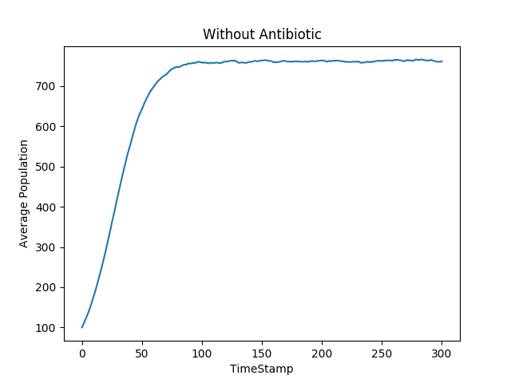
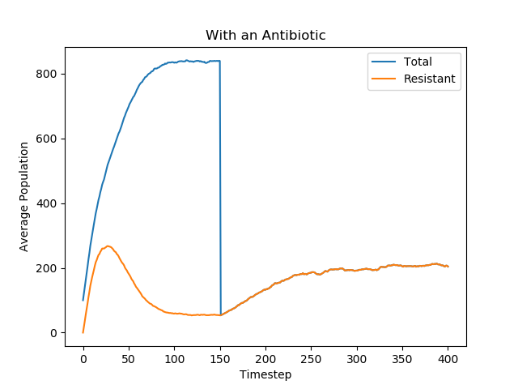
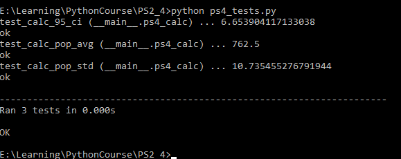

# 实验报告
## 一、 实验目的
编写程序模拟病菌在是否有抗生素的情况下数量随时间的变化。
## 二、 Write up
1. Problem2

    在不使用抗生素的情况下，病菌数量随时间的关系如下图所示：
    

    ```python
    #模拟时使用的参数
    #num_bacteria, max_pop, birth_prob, death_prob, num_trials
    populations = simulation_without_antibiotic(100, 1000, 0.1, 0.025, 50)
    ```
2. Problem3
    
    在不使用抗生素的情况下，在第299个时间单位时，病菌数量的95%置信区间如下图所示：

    
3. Problem5
    在使用抗生素的情况下，使用不同的参数模拟两次：
    
    

    ```python
    #模拟时使用的参数
    total_pop, resistant_pop = simulation_with_antibiotic(num_bacteria=100,
                                                      max_pop=1000,
                                                      birth_prob=0.3,
                                                      death_prob=0.2,
                                                      resistant=False,
                                                      mut_prob=0.8,
                                                      num_trials=50)

    total_pop, resistant_pop = simulation_with_antibiotic(num_bacteria=100,
                                                        max_pop=1000,
                                                        birth_prob=0.17,
                                                        death_prob=0.2,
                                                        resistant=False,
                                                        mut_prob=0.8,
                                                        num_trials=50)
    ```
    
    在使用抗生素的情况下，在第299个时间单位时，两次模拟时病菌总数量以及具有抗药性的病菌数量的95%置信区间如下图所示：

    
4. Problem 6
    1. 在引入抗生素之前，第一次模拟时，病菌总数量快速增长，大约在第75个时间单位处结束增长，此后病菌数量大致保持不变。
    而在第二次模拟时，病菌总数量先开始增长，大约在第40个时间单位处，病菌数量开始下降。


        造成差异的原因主要是第二次模拟时，病菌的出生率（<i>birth_prob*（1-pop_density）</i>）较低，并且在病菌密度较低时，病菌容易变异从而具有抗药性，而具有抗药性又会导致病菌死亡率（<i>death_prob</i>）升高，从而最终病菌种群的平均死亡率大于平均出生率，导致病菌种群密度（<i>pop_density</i>）的降低。

        而第一次模拟时，在病菌总数量达到最大值后，病菌的平均死亡率和出生率达到平衡，从而病菌的总数量可以保持平衡。

    2. 两次模拟时，具有抗药性的病菌的数量都是先快速增加，然后逐渐减少。
    
        第一次模拟时，由于病菌的出生率较高，因此在开始时可以获得快速的增长。由于在种群密度较低时，病菌可以获得抗药性的概率更大。因此，具有抗药性的病菌的数量在初期也会大幅增加。但是由于具有抗药性的病菌的死亡率会升高，在没有抗生素的情况下，具有抗药性的病菌在竞争中无法获得优势，因此随着时间的推移，具有抗药性的病菌的数量会逐渐下降直至稳定在一个较低的水平。

        第二次模拟时，具有抗药性的病菌数量的趋势大致与第一次模拟的情况类似。首先在病菌种群密度较低时，具有抗药性的病菌的数量会大幅增加。因为具有抗药性的病菌死亡率高，因此会在竞争中失利，然后数量开始下降。

    3. 在两次模拟中，引入抗生素后，没有抗药性的病菌都会马上死亡。但是在第一次模拟中，加入抗生素后病菌的总数量还会有一定程度的上升；在第二次模拟中，病菌总数量逐渐减少直至为0.
       
        在第一次模拟中，加入抗生素时，具有抗药性的病菌的数量大约为50左右，可以计算出此时出生率（<i>birth_prob*（1-pop_density）</i>）为0.285，此时死亡率为0.2，因此病菌总数量还会有一定程度的上升。

        而在第二次模拟时，由于birth_prob为0.17，因此出生率（<i>birth_prob*（1-pop_density）</i>）不可能超过0.17，而死亡率为0.2，因此，病菌的总数量一定会逐渐减少，直至为0.

    4. 大致同3.
        
        在第一次模拟中，加入抗生素后抗药性病菌的数量会有一定程度的上升；在第二次模拟中，抗药性病菌数量逐渐减少直至为0.

        在第一次模拟中，加入抗生素时，具有抗药性的病菌的数量大约为50左右，可以计算出此时出生率（<i>birth_prob*（1-pop_density）</i>）为0.285，此时死亡率为0.2，因此病菌总数量还会有一定程度的上升。

        而在第二次模拟时，由于birth_prob为0.17，因此出生率（<i>birth_prob*（1-pop_density）</i>）不可能超过0.17，而死亡率为0.2，因此，病菌的总数量一定会逐渐减少，直至为0.

## 三、 关键代码分析
1. 病人体内病菌数量的更新
    ```python
    class Patient(object):

    pass

    def update(self):
        surviving_bacteria=[]#存活的病菌
        for bacteria in self.bacteria:
            if not bacteria.is_killed():#如果病菌没有死亡
                surviving_bacteria.append(bacteria)
        #将当前bacteria替换为surviving_bacteria
        self.bacteria=surviving_bacteria[:]
        pop_density=self.get_total_pop()/self.max_pop#计算病菌种群密度
        for bacteria in surviving_bacteria:#判断病菌是否繁殖
            child=SimpleBacteria(0,0)
            try:
                child=bacteria.reproduce(pop_density)
            except NoChildException:#捕获NoChildException异常
                continue
            self.bacteria.append(child)#加入到self.bacteria中
        return self.get_total_pop()#返回当前的病菌数量
    ```
2. 模拟没有抗生素时病菌数量随时间的变化
    ```python
    def simulation_without_antibiotic(num_bacteria,
                                  max_pop,
                                  birth_prob,
                                  death_prob,
                                  num_trials):
        population=[]#存储每次测试时每个时间单位中病菌的数量
        for i in range(num_trials):#测试num_trials次
            bacteria_num=[num_bacteria]#单次测试时病菌的数量
            bacteria=[]#病菌对象的集合
            for j in range(num_bacteria):#实例化num_bacteria个病菌
                bacteria.append(SimpleBacteria(birth_prob,death_prob))
            patient=Patient(bacteria,max_pop)#实例化病人
            for j in range(300):#测试300个时间单位
                bacteria_num.append(patient.update())
            population.append(bacteria_num[:])#存储一次测试的数据
        avgs=[]#病菌数量的平均值
        for i in range(301):
            #计算每个时间单位病菌数量的平均值
            avgs.append(calc_pop_avg(population,i))
        x_coords=list(range(301))#横坐标
        #绘制图像
        make_one_curve_plot(x_coords,avgs,"TimeStamp","Average Population",
            "Without Antibiotic")
        return population
    ```
3. 模拟有抗生素时病菌数量随时间的变化
    ```python
    def simulation_with_antibiotic(num_bacteria,
                               max_pop,
                               birth_prob,
                               death_prob,
                               resistant,
                               mut_prob,
                               num_trials):
        total=[]#存储每次测试每个时间单位病菌总数目
        resistants=[]#存储每次测试每个时间单位具有抗药性病菌的数目
        for i in range(num_trials):#测试num_trials次
            bacteria=[]#存储病菌对象
            total_bacteria_num=[num_bacteria]#存储单次测试中病菌的总数量
            resistant_bacteria_num=[]#存储单次测试中具有抗药性病菌的数量
            for j in range(num_bacteria):#实例化num_bacteria个病菌
                bacteria.append(ResistantBacteria(birth_prob,
                    death_prob,resistant,mut_prob))
            patient=TreatedPatient(bacteria,max_pop)#实例化病人

            #记录初始时具有抗药性病菌的数量
            resistant_bacteria_num.append(patient.get_resist_pop())
            for j in range(150):#开始时没有抗生素
                total_bacteria_num.append(patient.update())#记录病菌总数量
                #记录具有抗药性的病菌数量
                resistant_bacteria_num.append(patient.get_resist_pop())
            patient.set_on_antibiotic()#使用抗生素给病人治疗
            for j in range(250):#再测试250个时间单位
                total_bacteria_num.append(patient.update())
                resistant_bacteria_num.append(patient.get_resist_pop())
            total.append(total_bacteria_num[:])#记录单次测试中病菌总数量
            #记录单次测试中具有抗药性的病菌数量
            resistants.append(resistant_bacteria_num[:])

        total_avg=[]#相同时刻病菌总数量的平均值
        resistant_avg=[]#相同时刻具有抗药性的病菌数量的平均值
        x_coords=list(range(401))#横坐标
        for i in range(401):#依次求平均值
            total_avg.append(calc_pop_avg(total,i))
            resistant_avg.append(calc_pop_avg(resistants,i))
        #根据求得的数据绘制图像
        make_two_curve_plot(x_coords,total_avg,resistant_avg,
            "Total","Resistant","Timestep","Average Population",
            "With an Antibiotic")
        return (total,resistants)
    ```

## 四、 实验结果
1. 运行ps4_tests.py的结果

    
2. 没有抗生素时病菌数量随时间的变化
    

3. 在使用抗生素的情况下模拟两次

    

    

## 五、 拓展
* 使用与题目中两次模拟相同的数据，但是不使用抗生素，观察随着时间变化，病菌数量的变化情况。
    

    * 刚开始时，病菌种群密度较低，因此出生率大致接近0.3，大于死亡率0.05，因此初期病菌总数量可以快速上升。
    * 后来随着时间推移，病菌总数量较大，导致出生率下降，最终接近于死亡率，导致病菌总数量维持在一个稳定水平。
    * 刚开始时，病菌种群密度较低，容易变异从而获得抗药性，此时抗药性病菌的数量也在快速增长。
    * 随着病菌总数量的增加，病菌变异获得抗药性的概率减小，再加上病菌获得抗药性后，死亡率陡增（没有抗药性的病菌的死亡率为0.05，抗药性病菌的死亡率为0.2），因此抗药性病菌在竞争中无法获得优势，然后抗药性病菌的数量会下降，最终稳定在一个较低的水平。

    

    * 刚开始时，病菌种群密度较低，因此出生率大致接近0.17，大于死亡率0.05，因此初期病菌总数量可以快速上升。
    * 与此同时，病菌由于种群密度较低，很容易变异从而获得抗药性，因此抗药性病菌的数量也在快速增加。
    * 但是很快，由于抗药性病菌的死亡率很高（0.2）且在种群中比例较大（约50%），导致种群的平均死亡率大于出生率，最终种群的数量不断减少，直至为0.