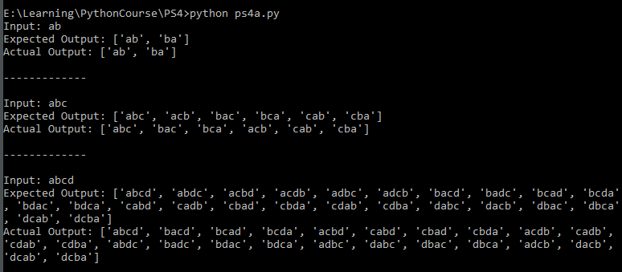
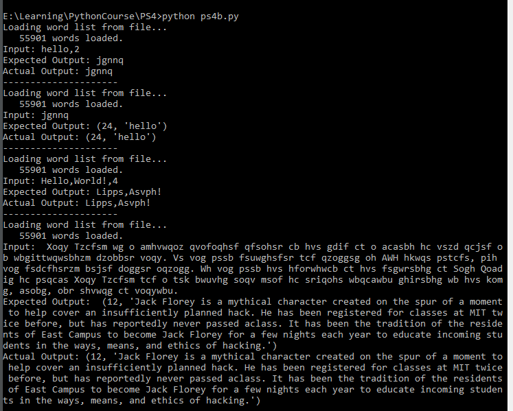
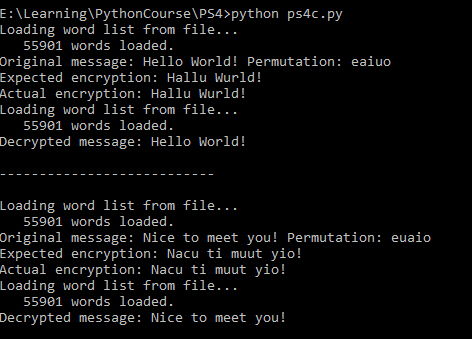

#实验报告

## 一、 实验目的
通过编写程序了解递归以及类与类的继承
## 二、 程序提纲
*注：为适应排版，此处代码与源代码有所出入*
### 辅助函数
1. 从文本文件中加载单词
```python
def load_words(file_name)
```
2. 判断一个字符串是否为单词列表中的一个合法单词
```python
def is_word(word_list, word)
```
3. 从文本中加载加密后的故事文件中的内容
```python
def get_story_string():
```
### Part A: Permutations of a string
* 计算一个给定字符串的全排列
```python
def get_permutations(sequence)
```
### Part B: Cipher Like Caesar
* B部分主要由三个类组成
```python
class Message(object):#Message类
    def __init__(self, text):#初始化
        object.__init__(self)
        self.message_text=text
        self.vaild_words=load_words(WORDLIST_FILENAME)
        pass
    def get_message_text(self):#message_text的getter函数
        pass
    def get_valid_words(self):#vaild_words的getter函数
        pass
    def build_shift_dict(self, shift):
        #根据给定的偏移量，确定每个字母的对照字母
        pass
    def apply_shift(self, shift):
        #将每个字母向后偏移shift位，得到加密后的文本
        pass

class PlaintextMessage(Message):#PlaintextMessage类
    def __init__(self, text, shift):#初始化
        Message.__init__(self,text)#初始化父类
        self.shift=shift#偏移量
        #用于加密的字母对照表
        self.encryption_dict=self.build_shift_dict(shift)
        #加密后的文本
        self.message_text_encrypted=self.apply_shift(shift)
        pass
    def get_shift(self):#shift的getter函数
        pass
    def get_encryption_dict(self):
        #encryption_dict的getter函数
        pass
    def get_message_text_encrypted(self):
        #message_text_encrypted的getter函数
        pass
    def change_shift(self, shift):
        #更改类中成员shift的值，同时改变
        #encryption_dict与message_text_encrypted
        pass

class CiphertextMessage(Message):#CiphertextMessage类
    def __init__(self, text):#初始化
        Message.__init__(self,text)#初始化父类
        pass
    def decrypt_message(self):#尝试解密加密的文本
        pass
    
```
### Part C: CiphertextMessage
* C部分由两个类组成
```python
class SubMessage(object):#SubMessage类
    def __init__(self, text):#初始化
        object.__init__(self)
        self.message_text=text
        self.vaild_words=load_words(WORDLIST_FILENAME)
        
    def get_message_text(self):#message_text的getter函数
        pass
    def get_valid_words(self):#vaild_words的getter函数
        pass
    def build_transpose_dict(self, vowels_permutation):
        #建立字母对照表，其中
        #辅音字母不变，
        #元音字母顺序由传入的vowels_permutation决定
        pass
    def apply_transpose(self, transpose_dict):
        #使用给定的字母对照表加密元素
        pass

class EncryptedSubMessage(SubMessage):#EncryptedSubMessage类
    def __init__(self, text):#初始化
        SubMessage.__init__(self,text)#初始化父类
    def decrypt_message(self):
        #尝试解密加密的文本
        pass
```
## 三、 程序细节
### Part A: Permutations of a string
```python
def get_permutations(sequence):
    length=len(sequence)#sequence长度
    #当长度为1时，返回sequence
    if 1==length:
        return [sequence]
    ans=[]
    seq=''
    #采用递归，即递归求得除去第一个字母之后的字符串的全排列的列表
    #再将第一个字母插入到列表中的每一个字符串之间
    #假设sequence长度为n，则其全排列有f(n)种。
    #除去第一个字母后的字符串的全排列有f(n-1)种
    #将第一个字母插入时，考虑将其插入到第一个字符串中，
    #该字符串长度为n-1，共有n个位置
    #因为n-1个字母组成的字符串的全排列有f(n-1)种
    #故f(n)=n*f(n-1)，又f(1)=1
    #所以f(n)=n!
    for j in range(length):
        if j!=0:
            seq+=sequence[j]
    temp=get_permutations(seq)
    for seq in temp:
        for j in range(length):
            ans.append(seq[0:j]+sequence[0]+seq[j:])
    return ans
```
### Part B: Cipher Like Caesar
```python
class Message(object):#Message类
    def __init__(self, text):#初始化
        object.__init__(self)
        self.message_text=text
        self.vaild_words=load_words(WORDLIST_FILENAME)

    def get_message_text(self):#message_text的getter函数
        return self.message_text

    def get_valid_words(self):#vaild_words的getter函数
        return self.vaild_words[:]

    #根据给定的偏移量，确定每个字母的对照字母
    def build_shift_dict(self, shift):
        ans={}
        upper=string.ascii_uppercase#大写字母
        length=len(upper)
        for i in range(length):
            #取模防止数组越界
            ans[upper[i]]=upper[(i+shift)%length]
        lower=string.ascii_lowercase#小写字母
        for i in range(length):
            ans[lower[i]]=lower[(i+shift)%length]
        return ans

    def apply_shift(self, shift):
        #将每个字母向后偏移shift位，得到加密后的文本
        d=self.build_shift_dict(shift)
        length=len(self.message_text)
        ans=''
        #一一替换
        for i in range(length):
            ch=self.message_text[i]
            ans+=d.get(ch,ch)
        return ans

class PlaintextMessage(Message):#PlaintextMessage类
    def __init__(self, text, shift):#初始化
        Message.__init__(self,text)#父类初始化
        self.shift=shift
        self.encryption_dict=self.build_shift_dict(shift)
        self.message_text_encrypted=self.apply_shift(shift)

    def get_shift(self):#shift的getter函数
        return self.shift

    def get_encryption_dict(self):#encryption_dict的getter函数
        return self.encryption_dict.copy()

    def get_message_text_encrypted(self):
        #message_text_encrypted的getter函数
        return self.message_text_encrypted

    def change_shift(self, shift):#更改成员变量中shift的值
        self.shift=shift
        #修改encryption_dict与message_text_encrypted
        self.encryption_dict=self.build_shift_dict(shift)
        self.message_text_encrypted=self.apply_shift(shift)

class CiphertextMessage(Message):#CiphertextMessage类
    def __init__(self, text):#初始化
        Message.__init__(self,text)#初始化父类

    def decrypt_message(self):#尝试解密文本
        chars=string.ascii_letters#大小写字母
        max_real_word=0#解密得到的文本中合法单词的数目
        best_shift=0#当前shift的最优解
        text=''#解密后的文本
        for i in range(26):
            #依次尝试0~25
            #将加密后的文本中的字母向后偏移i位
            s=self.apply_shift(i)
            
            #统计偏移后文本中合法单词数目
            temp_real_word=0
            word=''#当前的单词
            for j in s:
                if j in chars:#遇到字母，将其加入到word中
                    word+=j
                else:#如果不是，表示一个单词的结束
                    #检测当前单词是否合法
                    if is_word(self.vaild_words,word):
                        temp_real_word+=1
                    word=''#清空单词中内容
            #如果此时word不为空，检测word是否为合法单词
            if len(word)>0:
                if is_word(self.vaild_words,word):
                        temp_real_word+=1
            #检测当前偏移量是否是较优解
            if temp_real_word>max_real_word:
                #更新max_real_word、best_shift、text
                max_real_word=temp_real_word
                best_shift=i
                text=s
        return (best_shift,text)
```
### Part C: CiphertextMessage
```python
class SubMessage(object):#SubMessage类
    def __init__(self, text):#初始化
        object.__init__(self)
        self.message_text=text
        self.vaild_words=load_words(WORDLIST_FILENAME)
    
    def get_message_text(self):#message_text的getter函数
        return self.message_text

    def get_valid_words(self):#vaild_words的getter函数
        return self.vaild_words[:]
                
    def build_transpose_dict(self, vowels_permutation):
        #建立字母对照表
        ans={}
        #辅音字母不变
        for ch in CONSONANTS_LOWER:
            ans[ch]=ch
        for ch in CONSONANTS_UPPER:
            ans[ch]=ch

        #转为大写字母
        vowels_permutation=vowels_permutation.lower()
        for i in range(5):
            ans[VOWELS_LOWER[i]]=vowels_permutation[i]
        #转为小写字母
        vowels_permutation=vowels_permutation.upper()
        for i in range(5):
            ans[VOWELS_UPPER[i]]=vowels_permutation[i]
        return ans
        
    
    def apply_transpose(self, transpose_dict):
        #加密文本
        #一一对照
        ans=''
        for ch in self.message_text:
            ans+=transpose_dict.get(ch,ch)
        return ans
        
class EncryptedSubMessage(SubMessage):#EncryptedSubMessage类
    def __init__(self, text):#初始化
        SubMessage.__init__(self,text)#初始化父类

    def decrypt_message(self):#尝试解密文本
        #大小写字母
        chars=string.ascii_letters
        #求‘aeiou’的全排列
        permutations=get_permutations('aeiou')
        #最大合法单词数
        max_real_word=0
        #消息的最优解
        best_message=''

        #尝试全排列中的每一种排列
        for permutation in permutations:
            #d为某一种排列下产生的字母对照表
            d=self.build_transpose_dict(permutation)
            #使用这个字母对照表再一次加密这个文本
            #如果合适的话，加密会变成解密
            text=self.apply_transpose(d)

            word=''#当前的单词
            #统计偏移后文本中合法单词数目
            temp_real_world=0

            for ch in text:
                if ch in chars:#遇到字母，将其加入到word中
                    word+=ch
                else:#如果不是，表示一个单词的结束
                    #检测当前单词是否合法
                    if is_word(self.vaild_words,word):
                        temp_real_world+=1
                    word=''#清空单词中内容
            #如果此时word不为空，检测word是否为合法单词
            if len(word)>0:
                if is_word(self.vaild_words,word):
                    temp_real_world+=1
            #检测当前偏移量是否是较优解
            if temp_real_world>=max_real_word:
                #更新max_real_word、best_message
                max_real_word=temp_real_world
                best_message=text
        return best_message
```
## 四、 运行结果
* Part A: Permutations of a string
    
* Part B: Cipher Like Caesar
    
* Part C: CiphertextMessage

    
## 五、 实验心得
* 在部分B和C中，需要根据字母转换表进行字符替换。而诸如“,.!”之类的字符并不在表中，使用字典的[]操作符会导致KeyError，因此在这些地方使用了dict.get(ch,ch)方法，其中dict是字母转换表，ch是想要替换的字符，当ch不在字符转换表中时，get方法会返回ch本身，这样既不会引起程序错误，又保证程序正确性。
* 在部分B和C中，对加密文本进行解密的时候，由于解密出来的文本中可能带有各种各样的单词分隔符，如“,!.”等，在这样的情况下，str.split()方法不是很方便，因此在此重新写了一种分割的方法，详情可以见程序细节部分。
