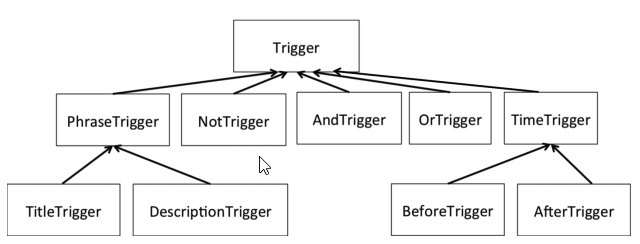
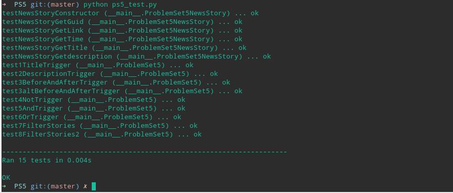
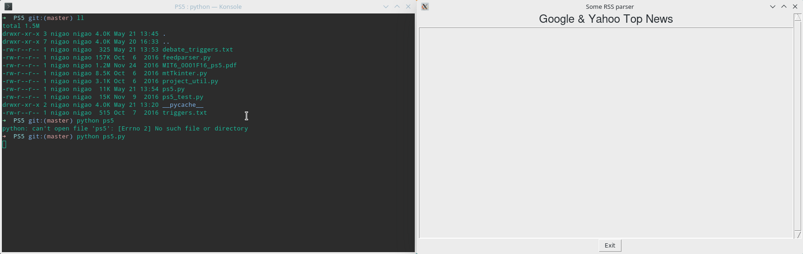

# 实验报告
## 一、 实验目的
实现RSS信息流的过滤以及配置文件的解析。
## 二、程序
<i>注：为适应排版，此处代码与源代码有所出入</i>

1.  NewStory类，用于存储一条新闻的信息
    ```python
    class NewsStory:
        def __init__(self, guid, title, description, link, pubdate):
            self.guid=guid
            self.title=title#标题
            self.description=description#描述
            self.link=link#链接
            self.pubdate=pubdate#发表日期

        def get_guid(self):#guid的getter函数
            return self.guid

        def get_title(self):#标题的getter函数
            return self.title

        def get_description(self):#描述的getter函数
            return self.description

        def get_link(self):#链接的getter函数
            return self.link

        def get_pubdate(self):#发表日期的getter函数
            return self.pubdate
    ```
2.  触发器基类（不能创建对象，只用作基类）
    ```python
    class Trigger(object):
        def evaluate(self, story):
            #防止创建对象
            raise NotImplementedError
    ```
3. 文本解析类（不能创建对象，只用作基类）
    ```python
    class PhraseTrigger(Trigger):
        def __init__(self,phrase):
            Trigger.__init__(self)
            phrase=phrase.lower()#转为小写字母
            self.phrase=phrase#特征短语

        #检测文本text中是否含有特征短语phrase
        def is_phrase_in(self,text):
            text=text.lower()#转为小写字母
            text+=' '#在待匹配文本末尾加上空格
            sepatator='[ '+string.punctuation+']'#合法的分隔符
            words=self.phrase.split(' ')#将特征短语拆分为单词
            pattern=''#正则表达式的匹配式
            for word in words:#构造正则表达式
                pattern+=word+sepatator+'+'
            result=re.search(pattern,text)#用正则表达式匹配

            if result:#如果正则表达式的匹配结果不为空
                return True
            return False
    ```
4. 标题匹配类
    ```python
    class TitleTrigger(PhraseTrigger):#
            def __init(self,title):#初始化父类
                PhraseTrigger.__init__(self,title)

        def evaluate(self, story):#检测新闻标题中是否含有title
            if self.is_phrase_in(story.title):#调用父类的is_phrase_in方法
                return True
            return False
    ```
 5. 描述匹配类
    ```python
    class DescriptionTrigger(PhraseTrigger):
    def __init__(self,description):#初始化父类
        PhraseTrigger.__init__(self,description)
    
    def evaluate(self, story):#检测新闻描述中是否含有description
        if self.is_phrase_in(story.description):#调用父类的is_phrase_in方法
            return True
        return False
    ```
6. 时间处理类
    ```python
    class TimeTrigger(Trigger):
        #将合法的时间字符串转换为datetime的aware对象
        def __init__(self,time):
            Trigger.__init__(self)#初始化父类
            pubdate=datetime.now()
            try:
                pubdate = datetime.strptime(time, "%d %b %Y %H:%M:%S")
                pubdate.replace(tzinfo=pytz.timezone("EST"))
            #  pubdate = pubdate.astimezone(pytz.timezone('EST'))
            #  pubdate.replace(tzinfo=None)
            except ValueError:
                pubdate = datetime.strptime(time, "%d %b %Y %H:%M:%S")
            #加上时区信息
            self.dt=pubdate.replace(tzinfo=pytz.timezone("EST"))
    ```
7. 判断发表时间在某个时间之前或之后的类
    ```python
    class BeforeTrigger(TimeTrigger):
        def __init__(self, time):
            TimeTrigger.__init__(self,time)#初始化父类
        
        def evaluate(self, story):
            #这里需要给story.pubdate加上时区信息
            return story.pubdate.replace(tzinfo=pytz.timezone("EST"))<self.dt

    class AfterTrigger(TimeTrigger):
        def __init__(self, time):
            TimeTrigger.__init__(self,time)#初始化父类
        
        def evaluate(self, story):
            #这里需要给story.pubdate加上时区信息
            return story.pubdate.replace(tzinfo=pytz.timezone("EST"))>self.dt
    ```
8. 触发器的逻辑处理类
    ```python
    class NotTrigger(Trigger):#取反
        def __init__(self,trigger):
            Trigger.__init__(self)#初始化父类
            self.trigger=trigger#触发器
        
        def evaluate(self, story):
            #对self.trigger判断的结果取反
            return not self.trigger.evaluate(story)

    class AndTrigger(Trigger):#求交
        def __init__(self,trigger1,trigger2):
            Trigger.__init__(self)#初始化父类
            self.trigger1=trigger1
            self.trigger2=trigger2
        
        def evaluate(self, story):
            #对两个触发器的结果求交
            return self.trigger1.evaluate(story) and self.trigger2.evaluate(story)

    class OrTrigger(Trigger):#求并
        def __init__(self,trigger1,trigger2):
            Trigger.__init__(self)#初始化父类
            self.trigger1=trigger1
            self.trigger2=trigger2
        
        def evaluate(self, story):
            #对两个触发器的结果求交
            return self.trigger1.evaluate(story) or self.trigger2.evaluate(story) 
    ```
9. 根据触发器过滤新闻
```python
def filter_stories(stories, triggerlist):
    fired=[]#感兴趣的新闻的集合
    for story in stories:#遍历stories
        for trigger in triggerlist:#遍历triggerlist
            if trigger.evaluate(story):#如果新闻符合该触发器
                fired.append(story)#加入到感兴趣的新闻集合中
                break#跳出内层循环
    return fired
```
10. 解析触发器的配置文件
```python
def read_trigger_config(filename):
    trigger_file = open(filename, 'r')
    lines = []
    #去掉注释去空白行
    for line in trigger_file:
        line = line.rstrip()
        if not (len(line) == 0 or line.startswith('//')):
            lines.append(line)

    ans=[]#已经加入的触发器的集合
    triggers={}#触发器与其名称的对应关系
    for line in lines:#遍历每一行
        words=line.split(',')#把每一行分解为单词
        word_num=len(words)#单词的个数
        if words[0]=='ADD':#如果第一个单词是ADD
            #将从第二个到最后一个单词代表的触发器加入到ans中
            for i in range(1,word_num):
                #检测triggers中是否有对应的触发器
                trigger=triggers.get(words[i],None)
                if trigger:
                    ans.append(trigger)
        else:#定义新的触发器
            trigger_name=words[0]#第一个单词是触发器的名称
            if words[1]=="TITLE":#标题触发器
                #根据第三个单词的内容定义一个标题触发器对象
                triggers[trigger_name]=TitleTrigger(words[2])
            elif words[1]=="DESCRIPTION":#描述触发器
                #根据第三个单词的内容定义一个描述触发器对象
                triggers[trigger_name]=DescriptionTrigger(words[2])
            elif words[1]=="AFTER":
                #根据第三个单词的内容定义一个时间触发器对象
                triggers[trigger_name]=AfterTrigger(words[2])
            elif words[1]=="BEFORE":
                #根据第三个单词的内容定义一个时间触发器对象
                triggers[trigger_name]=BeforeTrigger(words[2])
            elif words[1]=="NOT":#取反触发器
                trigger=triggers.get(words[2],None)
                if trigger:
                     #根据第三个单词的内容定义一个取反触发器对象
                    triggers[trigger_name]=NotTrigger(trigger)
            elif words[1]=="AND":#求交触发器
                trigger1=triggers.get(words[2],None)
                trigger2=triggers.get(words[3],None)
                if trigger1 and trigger2:
                     #根据第三、四个单词的内容定义一个求交触发器对象
                    triggers[trigger_name]=AndTrigger(trigger1,trigger2)
            elif words[1]=="OR":#求并触发器
                trigger1=triggers.get(words[2],None)
                trigger2=triggers.get(words[3],None)
                if trigger1 and trigger2:
                    #根据第三、四个单词的内容定义一个求并触发器对象
                    triggers[trigger_name]=OrTrigger(trigger1,trigger2)
    return ans
```
## 三、 触发器配置文件
打开网页得知四次辩论的日期分别为：
* Monday, September 26, 2016
* Tuesday, October 4, 2016
* Sunday, October 9, 2016
* Wednesday, October 19, 2016
时间均为美东时间（EST）9pm to 10:30pm 。
题目要求获取辩论前后三个小时的新闻，以第一次辩论为例，也就是 26日的下午6点到27日的凌晨1点半，即晚于26日的下午6点，早于27日的凌晨1点半，所以配置文件可以写成:
    ```txt
    //格式要合法
    t1,AFTER,26 Sep 2016 18:00:00

    t2,BEFORE,27 Sep 2016 1:30:00

    t3,AND,t1,t2
    ```
最后再将这两个触发器求交即可。
## 四、 运行结果
* 运行ps5_test.py的结果

* 运行ps5.py的结果

猜测页面空白是由于无法连接到境外的服务器。
## 五、 实验心得
